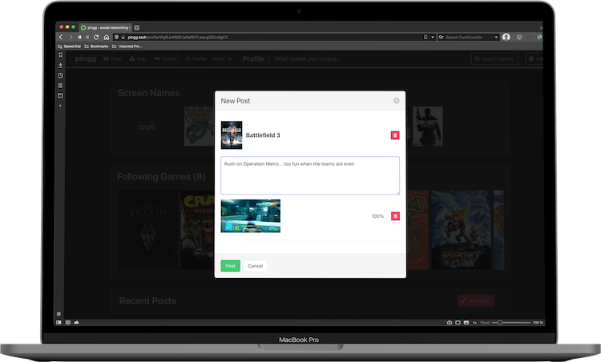

- Select the game to which to post. Once you begin typing, suggestions will appear for you.
- Click the 'New Post' button on the right side of the screen to create a new post. A pop-up window will appear with a field for text and a field for images.
- Begin typing your post! Text must be between 10 and 120 characters.
    - To include an image, drag and drop an image file from your computer to the image field.
- Once you have filled out the post, click the 'Post' button in the bottom right of the window to finalize the post and make it public.

