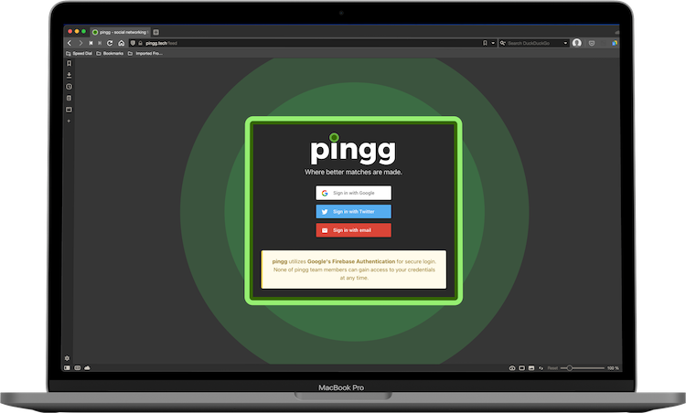

To access **pingg** you will first need to register an account. You can create an account using your email address or link an existing account for a different service.

:::tip

We currently allow third-party sign in through Google and Twitter.

:::

To create a new account using your email address, click on 'Sign in with email' and enter your desired email address into the prompt. You will then be asked to choose a password for your account. After you have successfully entered your information, click 'SAVE' to finalize your information. You will now be redirected to your **pingg** homepage. Before you begin using the site for the first time, you will be asked to complete a form with personal information.

Alternately, you can create a linked account through Google or Twitter by clicking the corresponding button on the sign in page. Once you have chosen one of these services, follow the instructions in the pop-up dialog to finish account creation. Once completed, you will be signed in and redirected to your **pingg** homepage.

:::important

**pingg** utilizes Google's Firebase Authentication for secure login. None of the **pingg** team members can gain access to your credentials at any time.

:::

## Logging Out
Once your account has been registered, you will remain signed in to **pingg** until you logout or clear your browser. To sign out of **pingg** manually, mouse over 'More' in the site header to reveal a drop-down menu. Click “Logout” at the bottom of the menu.
