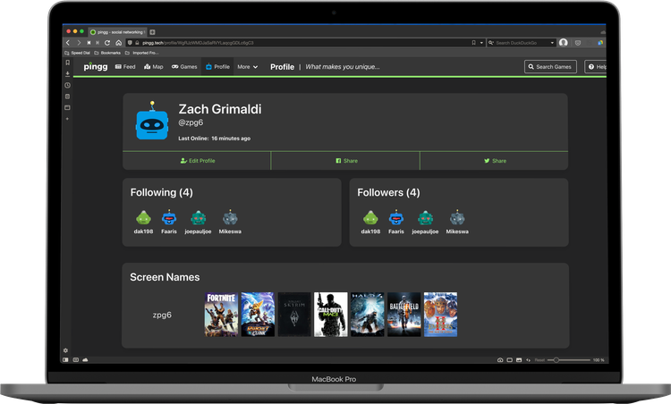

- Click 'Profile' at the top of the page.
- On your profile screen, click the 'Edit Profile' button at the left side of the screen.
- Enter the desired information in the appropriate fields
- Click the 'Save' button in the bottom right to finalize your changes and apply them to your profile publicly. 

:::note

Note that refreshing the page before pressing 'Save' will discard all active changes.

:::

- After you press 'Save' your current screen will show your newly updated profile as it appears to other users.

:::tip

You may need to refresh your browser to see your changes.

:::

